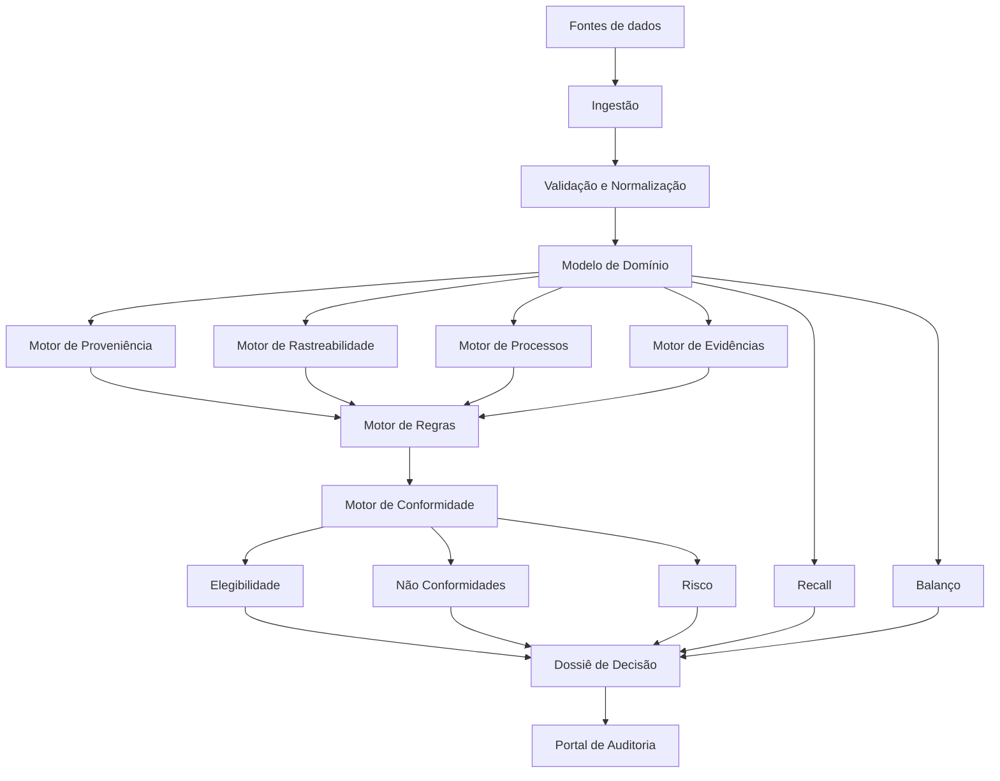
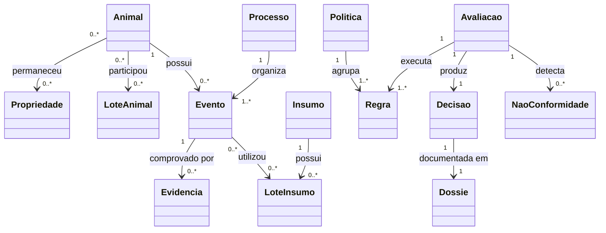

# Titan Technologies
## Arquitetura Conceitual e Modelo de Domínio — Versão 2.0

> **Toda informação deve ser rastreável.  
> Toda decisão deve ser reproduzível.  
> Toda conclusão deve ser justificável.**

---

## 1. Propósito

Este documento consolida a visão atual do **Titan**, considerando:

- os problemas observados em vagas de rastreabilidade de frigoríficos;
- rastreabilidade, recall, auditoria, balanço e conformidade;
- operação sem dependência obrigatória de IoT;
- inclusão gradual de pequenos produtores;
- integração com o Omni-Data;
- rastreamento de medicamentos, alimentação e demais insumos;
- auditabilidade de dados, regras, evidências e decisões.

O documento é um artefato vivo. Deve evoluir conforme entrevistas, validações e provas de conceito.

---

# 2. Visão do produto

O Titan não deve ser apenas um sistema de rastreabilidade animal.

> **Titan é uma Plataforma de Inteligência para Conformidade da Cadeia Pecuária.**

Seu papel é transformar dados dispersos em:

- histórico confiável;
- alertas e não conformidades;
- análise de risco;
- decisões de elegibilidade;
- simulações de recall;
- dossiês auditáveis;
- explicações compreensíveis.

A rastreabilidade continua essencial, mas passa a alimentar um objetivo maior:

> **Gerar confiança verificável sobre animais, propriedades, insumos, processos, produtos e decisões.**

---

# 3. Problema central

Já existem empresas que afirmam rastrear animais e produtos. Mesmo assim, continuam ocorrendo:

- embargos e bloqueios comerciais;
- inconsistências documentais;
- dificuldade em comprovar origem;
- demora em responder auditorias;
- baixa integração entre produtores, certificadoras, frigoríficos e sistemas públicos;
- dificuldade em identificar todos os afetados por um problema;
- incapacidade de reproduzir uma decisão tomada no passado.

Hipótese central:

> **O problema não é apenas a ausência de rastreabilidade. O problema é a incapacidade de comprovar, validar e explicar a conformidade de toda a cadeia.**

---

# 4. Princípios arquiteturais

## 4.1 Auditabilidade por padrão

Todo dado relevante deve registrar:

- origem;
- autor;
- data e hora do fato;
- data e hora do registro;
- sistema ou dispositivo de origem;
- alterações e justificativas;
- evidências associadas;
- nível de confiança.

## 4.2 Imutabilidade lógica

Registros históricos não devem ser apagados ou sobrescritos silenciosamente. Uma correção deve gerar:

1. revogação ou retificação do registro anterior;
2. justificativa;
3. novo registro;
4. vínculo entre as versões.

## 4.3 Regras versionadas

Toda decisão deve indicar:

- política aplicada;
- versão da política;
- regras avaliadas;
- período de vigência;
- dados utilizados;
- resultado de cada regra.

## 4.4 Independência de hardware

O núcleo deve funcionar com entrada manual, documentos, planilhas, aplicativos, APIs e sistemas de terceiros. RFID, câmeras, balanças e sensores são fontes opcionais de evidência.

## 4.5 Explicabilidade

O Titan não deve retornar apenas `APROVADO` ou `BLOQUEADO`. Deve explicar:

- o que ocorreu;
- quais regras falharam;
- quais entidades foram afetadas;
- quais evidências sustentam a conclusão;
- como corrigir ou mitigar o problema.

## 4.6 Operação offline

O aplicativo de campo deve tolerar internet instável. Os eventos podem ser registrados offline e sincronizados posteriormente, preservando horário do fato, dispositivo, usuário e conflitos de sincronização.

## 4.7 Características fundamentais do Titan Core

O Titan Core é o núcleo reutilizável da plataforma. Ele conecta fatos, eventos, evidências e políticas para produzir decisões auditáveis, sem conhecer os conceitos particulares de uma vertical. Termos como animal, GTA, medicamento, peça ou alimento pertencem às verticais e nunca devem ser incorporados ao Core.

### 4.7.1 Integridade não significa verdade

O Titan não transforma uma declaração em verdade. Para toda informação relevante aceita, o Core deve permitir demonstrar:

- a Organization proprietária;
- quem informou;
- quando o fato teria ocorrido;
- quando a informação foi registrada;
- a fonte, o sistema ou o dispositivo de origem;
- a versão do contrato utilizado;
- as evidências associadas;
- o grau de confiança disponível;
- as correções, verificações, expirações ou revogações posteriores;
- as avaliações, decisões e dossiês que utilizaram a informação.

O Core afirma que uma decisão foi produzida com determinadas informações, evidências, regras e versões em um momento definido. Ele não afirma automaticamente que o fato declarado corresponde à realidade.

### 4.7.2 Envelope auditável

Toda operação relevante deve possuir, quando aplicável:

```text
Operação
├── identificador único
├── Organization
├── ator
├── fonte
├── sistema ou dispositivo
├── ocorrido em
├── registrado em
├── versão do contrato
├── correlação e causação
├── chave de idempotência
├── conteúdo
├── evidências relacionadas
├── referência de correção
├── hash anterior
└── hash atual
```

Tokens, senhas, secrets e dados desnecessários não devem ser registrados na auditoria. Auditabilidade não autoriza coleta indiscriminada de dados.

### 4.7.3 Histórico imutável e correções explícitas

Eventos, evidências, políticas publicadas, avaliações, decisões e dossiês não são sobrescritos. Uma correção deve criar um novo registro, preservar o original, identificar o responsável, registrar a justificativa e estabelecer vínculo explícito entre as versões.

O estado atual é uma projeção conveniente. Ele nunca substitui o histórico e deve ser reconstruível a partir dos eventos.

### 4.7.4 Proveniência e impacto reverso

O Core deve permitir navegar nos dois sentidos:

```text
Source → Evidence → Event → Fact → Evaluation → Decision → Dossier
```

Partindo de uma decisão, deve ser possível chegar à fonte original. Partindo de uma evidência, deve ser possível localizar os eventos, avaliações, decisões e dossiês que dependem dela.

Se uma evidência expirar, for revogada ou tiver sua integridade comprometida, decisões históricas não são reescritas. Elas devem permanecer preservadas e podem ser marcadas como potencialmente afetadas para reavaliação.

### 4.7.5 Genealogia universal e temporal

O Core deve representar relações entre ativos sem conhecer o significado específico de cada vertical. Toda relação relevante deve registrar:

- origem e destino;
- tipo de relação;
- início e fim de validade;
- evento que criou a relação;
- evidências que a sustentam;
- Organization responsável;
- grau de confiança;
- quantidade, quando aplicável.

Transformações, participações em lotes, movimentações, exposições e utilizações são especializadas pelas verticais por meio de contratos públicos do Core.

### 4.7.6 Recall como consequência da genealogia

O Recall Core deve navegar nas relações universais e temporais para executar:

- rastreamento retrospectivo, do afetado até a origem;
- rastreamento prospectivo, da origem até todos os destinos conhecidos;
- análise limitada por janela temporal;
- operação interna a uma Organization;
- travessia autorizada entre Organizations;
- simulação, exercício periódico ou incidente real;
- localização de avaliações, decisões e dossiês potencialmente comprometidos.

Cada caminho encontrado deve ser explicável e apontar os eventos e as evidências que o sustentam. Quando existirem lacunas, o resultado deve declará-las explicitamente; um recall incompleto nunca deve ser apresentado como conclusivo.

### 4.7.7 Não conformidades rastreáveis

Uma não conformidade pode ser detectada por falha de regra, evidência ausente ou inválida, divergência entre fontes, sequência impossível de eventos, quebra de integridade ou conflito de sincronização.

Seu ciclo de vida deve preservar:

```text
Detecção
    ↓
Classificação e severidade
    ↓
Sujeitos e período afetados
    ↓
Responsável e prazo
    ↓
Ação corretiva
    ↓
Evidência da correção
    ↓
Reavaliação
    ↓
Encerramento
```

Toda não conformidade deve apontar para os fatos, eventos, evidências e regras que justificam sua existência. Seu encerramento não remove o histórico.

### 4.7.8 Consultas rápidas com projeções reconstruíveis

Eventos imutáveis preservam o histórico, mas consultas de recall e impacto não devem depender da leitura integral de todos os eventos. O Core pode manter índices, referências reversas e projeções de leitura para acelerar consultas.

Essas projeções:

- não são fontes de verdade;
- não podem introduzir regras de negócio;
- devem preservar isolamento por Organization;
- devem ser verificáveis;
- devem poder ser reconstruídas a partir dos eventos.

### 4.7.9 Operação offline sem perda silenciosa

O Core deve definir um protocolo de sincronização que preserve:

- identificador único gerado no dispositivo;
- Organization, ator e dispositivo;
- horário do fato separado do horário do registro;
- ordem local;
- versão do contrato;
- idempotência;
- confirmação individual de cada operação;
- retomada após interrupção;
- conflitos apresentados explicitamente.

O dispositivo pode registrar fatos offline, mas decisões oficiais são produzidas pelo servidor. Nenhum conflito deve ser resolvido silenciosamente.

### 4.7.10 Integridade verificável em níveis

A proteção de integridade deve evoluir sem exigir blockchain:

1. hash canônico e cadeia de hashes para detectar alterações;
2. checkpoints assinados com chave protegida;
3. checkpoints preservados em armazenamento externo imutável ou mecanismo independente de timestamp, quando o nível de garantia exigir.

Backups, restaurações e projeções devem preservar a capacidade de verificar a cadeia.

### 4.7.11 Separação entre Core e verticais

O Core pode fornecer contratos para referências, eventos, evidências, genealogia, políticas, regras, avaliações, decisões, dossiês, recall e sincronização. Cada vertical fornece entidades, fatos, relações, regras, adaptadores e templates próprios.

Uma vertical nunca deve exigir campos específicos no Core. O Core nunca deve consultar diretamente tabelas ou tipos internos de uma vertical.

Os conceitos adicionais descritos nesta seção devem ser formalizados em `DOMAIN.md` e, quando representarem decisão arquitetural, em ADR aprovada antes de qualquer implementação.

## 4.8 Fronteira aprovada do Titan Core

O Titan Core oferece mecanismos universais de confiança. As verticais fornecem o significado operacional. Esta fronteira deve ser preservada por contratos públicos e testes arquiteturais.

### 4.8.1 Módulos e responsabilidades do Core

| Módulo | Responsabilidade |
|---|---|
| Identity & Access | User, Organization, Membership, Role, Permission, organização ativa, autorização, isolamento e auditoria de segurança |
| Audit | Autoria, origem, timestamps, correlação, causação, histórico append-only e correções vinculadas |
| Integrity | Serialização canônica, hashes, cadeia de hashes, algoritmo versionado e verificação |
| Evidence & Provenance | Evidence, Source, ConfidenceLevel, validade, verificação, revogação, documentos, proveniência e impacto reverso |
| Genealogy | Referências universais, relações temporais, origem, destino, quantidade, eventos e evidências sustentadoras |
| Policies & Rules | Políticas e regras versionadas, vigência, fonte normativa, severidade, evidências requeridas e ações corretivas |
| Evaluation & Decision | Coleta de fatos por contratos, seleção de política, execução de regras, snapshot, agregação e decisão explicável |
| NonConformity | Detecção, classificação, sujeitos afetados, responsável, prazo, correção, reavaliação e encerramento histórico |
| Recall | Navegação retrospectiva e prospectiva, janela temporal, ciclos, profundidade, simulação, incidente e impacto em decisões |
| Dossier | Snapshot canônico, fatos, evidências, regras, decisão, não conformidades, ações, versões e hash |
| Reliability | Idempotência, concorrência otimista, transações, Outbox, retries, falhas permanentes e processamento auditável |
| Synchronization | Dispositivo, operação offline, sequência local, lotes, confirmação, retomada, rejeição e conflito explícito |
| Projections | Estado atual, índices, referências reversas e projeções reconstruíveis com isolamento por Organization |

O OIDC Provider autentica identidades e administra credenciais, sessões e fatores de autenticação. O Titan Core mantém o vínculo com User e executa toda autorização baseada em Organization, Membership, Role e Permission.

### 4.8.2 Contratos públicos previstos

O Core deve expor contratos genéricos equivalentes às seguintes responsabilidades:

```text
ActorReference
OrganizationReference
SubjectReference
EvidenceReference
DocumentReference
DomainEvent
UniversalRelation
FactProvider
SubjectProvider
RuleExecutor
PolicySelector
EvaluationRequest
RuleResult
DecisionResult
DossierTemplate
RecallRequest
RecallResult
OfflineOperation
SynchronizationResult
```

Os nomes definitivos dependem da linguagem formalizada em `DOMAIN.md`. Esta relação define fronteiras e não autoriza antecipar classes, interfaces ou abstrações sem uso no passo em execução.

### 4.8.3 Responsabilidades das verticais

Cada vertical fornece:

- entidades e invariantes específicas;
- fatos e eventos específicos;
- tipos especializados de relações;
- providers de fatos e sujeitos;
- regras regulatórias e políticas de mercado;
- adaptadores de integrações externas;
- templates de dossiê;
- interfaces operacionais.

No Titan Livestock, pertencem exclusivamente à vertical conceitos como RuralProperty, Animal, Veterinarian, LivestockLot, AnimalMovement, PropertyStay, Medication, MedicationBatch, VeterinaryPrescription, TreatmentApplication, WithdrawalPeriod, GTA, SISBOV e RFID, além das regras sanitárias, ambientais e farmacológicas.

### 4.8.4 Proibições arquiteturais

O Titan Core não pode:

- importar módulos de uma vertical;
- possuir campos específicos como `animal_id`, `medication_id` ou `gta_id`;
- consultar tabelas internas de uma vertical;
- interpretar payloads específicos de uma vertical;
- conhecer mercados ou normas pecuárias;
- conter regras sanitárias, ambientais ou farmacológicas;
- gerar templates específicos de Livestock;
- tratar ausência de dados como conformidade;
- alterar eventos, evidências, políticas publicadas, avaliações, decisões ou dossiês históricos;
- atravessar Organizations sem autorização explícita;
- afirmar que uma informação é verdadeira;
- depender de FastAPI, SQLAlchemy, PostgreSQL, MongoDB, OIDC Provider, Celery ou Message Broker na camada Domain.

As verticais dependem dos contratos do Core. O Core nunca depende das verticais. A infraestrutura implementa portas definidas pelas camadas internas sem introduzir regras de negócio.

### 4.8.5 Prova obrigatória da fronteira

Antes do Titan Livestock, o Core deve executar um cenário genérico:

```text
Ator autenticado
        ↓
Organization autorizada
        ↓
Fato fornecido por provider falso
        ↓
Evento auditável
        ↓
Evidência verificável
        ↓
Relação genealógica
        ↓
Política e regra versionadas
        ↓
Avaliação reproduzível
        ↓
Decisão explicável
        ↓
Não conformidade
        ↓
Recall
        ↓
Dossiê
```

A fronteira somente é considerada comprovada quando:

- nenhum termo de vertical existe no Core;
- providers falsos podem ser substituídos sem alteração do Core;
- duas Organizations permanecem isoladas;
- adulterações são detectadas;
- repetições não duplicam efeitos;
- fatos futuros não alteram decisões passadas;
- cada caminho de recall é explicável;
- lacunas são declaradas explicitamente;
- projeções são reconstruíveis;
- o dossiê é verificável sem acesso ao banco.

---

# 5. Pilares do Titan

```text
IDENTIDADE
    ↓
EVENTOS
    ↓
EVIDÊNCIAS
    ↓
PROVENIÊNCIA
    ↓
REGRAS
    ↓
DECISÕES
    ↓
AUDITORIA
    ↓
CONFIANÇA
```

---

# 6. Arquitetura conceitual



---

# 7. Fontes de dados

## 7.1 Pessoas

- produtor;
- funcionário da fazenda;
- veterinário;
- transportador;
- certificadora;
- frigorífico;
- auditor.

## 7.2 Documentos

- GTA;
- receitas veterinárias;
- certificados;
- laudos;
- notas fiscais;
- documentos de compra de insumos;
- relatórios laboratoriais;
- registros sanitários e ambientais.

## 7.3 Sistemas externos

- ERP;
- sistemas de gestão pecuária;
- SISBOV e plataformas do MAPA;
- sistemas estaduais;
- certificadoras;
- frigoríficos;
- laboratórios;
- Omni-Data.

## 7.4 Dispositivos opcionais

- RFID/NFC;
- leitores de brincos;
- balanças;
- câmeras;
- sensores;
- GPS;
- dispositivos ESP32.

---

# 8. Motores do sistema

## 8.1 Motor de Identidade

Garante identidade única e relacionável para:

- animal;
- propriedade;
- produtor;
- veterinário;
- fornecedor;
- insumo;
- lote;
- documento;
- carga;
- produto derivado.

### Valor

Reduz duplicidades, divergências entre sistemas e históricos fragmentados.

---

## 8.2 Motor de Rastreabilidade

Reconstrói o caminho de uma entidade no tempo.

### Perguntas

- Onde nasceu?
- Por quais propriedades passou?
- Quem foi responsável em cada período?
- Em quais lotes entrou?
- Para onde foi transportado?
- Em quais produtos foi transformado?

### Modos

- retrospectivo: produto até a origem;
- prospectivo: origem até todos os destinos;
- interno: dentro de uma organização;
- externo: entre organizações.

### Valor

Acelera recall, investigação e comprovação de origem.

---

## 8.3 Motor de Eventos

Registra fatos como:

- nascimento;
- identificação;
- transferência;
- vacinação;
- tratamento;
- exame;
- alimentação;
- pesagem;
- quarentena;
- transporte;
- abate;
- certificação;
- bloqueio e liberação.

Estrutura mínima:

```yaml
evento:
  id:
  tipo:
  entidade_principal:
  participantes:
  ocorrido_em:
  registrado_em:
  local:
  responsavel:
  fonte:
  dados:
  evidencias:
  status:
  evento_corrigido:
```

---

## 8.4 Motor de Processos

Controla sequências completas, não apenas eventos isolados.

Exemplos:

- vacinação;
- tratamento veterinário;
- transferência;
- alimentação;
- recepção no frigorífico;
- certificação;
- auditoria;
- recall.

Cada processo possui entradas, etapas, responsáveis, regras, evidências exigidas, resultado e exceções.

### Exemplo: tratamento veterinário

```text
Diagnóstico
    ↓
Prescrição
    ↓
Identificação do medicamento
    ↓
Aplicação
    ↓
Registro de lote e dose
    ↓
Cálculo da carência
    ↓
Liberação ou bloqueio
```

---

## 8.5 Motor de Proveniência

Responde de onde veio cada informação e como ela foi transformada.

```text
Decisão
    ↓
Resultado da regra
    ↓
Fato utilizado
    ↓
Evento
    ↓
Documento ou integração
    ↓
Fonte original
```

### Valor

Permite contestar, verificar e reproduzir conclusões.

---

## 8.6 Motor de Evidências

Gerencia tudo o que comprova um fato:

- documentos;
- fotos e vídeos;
- assinaturas;
- geolocalização;
- resultados laboratoriais;
- registros oficiais;
- leituras de dispositivos;
- confirmações de terceiros.

### Níveis de confiança

| Nível | Exemplo |
|---|---|
| Informado | Dado digitado sem anexo |
| Declarado | Dado assinado pelo responsável |
| Documentado | Documento válido anexado |
| Verificado | Conferido por terceiro ou sistema |
| Corroborado | Múltiplas fontes independentes |
| Oficial | Fonte governamental ou certificadora |

---

## 8.7 Motor de Regras

Representa requisitos:

- sanitários;
- ambientais;
- medicamentos e resíduos;
- alimentação;
- movimentação;
- bem-estar;
- documentação;
- mercado de destino;
- certificação.

```yaml
regra:
  codigo:
  titulo:
  politica:
  versao:
  vigencia_inicio:
  vigencia_fim:
  mercado:
  escopo:
  condicao:
  resultado_se_falhar:
  severidade:
  evidencias_exigidas:
  referencia_normativa:
```

As regras devem ser versionadas, testadas, aprovadas e publicadas de forma controlada.

---

## 8.8 Motor de Conformidade

Avalia entidades e processos segundo políticas e regras.

### Resultados possíveis

- conforme;
- não conforme;
- pendente;
- indeterminado;
- bloqueado;
- conforme com ressalvas.

---

## 8.9 Motor de Elegibilidade

Determina se um animal, lote, propriedade, carga ou produto está apto para uma finalidade.

Exemplo:

```text
Lote 2026-00871
Resultado: BLOQUEADO

Falhas:
- 2 animais com carência em andamento;
- 1 propriedade com evidência ambiental pendente;
- 3 documentos vencidos.

Ação recomendada:
- remover os animais A102 e A344;
- atualizar a documentação da propriedade P008;
- reavaliar o lote.
```

---

## 8.10 Motor de Não Conformidades

Detecta e acompanha:

- documento ausente ou vencido;
- animal duplicado;
- movimentação impossível;
- medicamento sem prescrição;
- carência não cumprida;
- alimento sem origem comprovada;
- ingrediente proibido;
- propriedade com restrição;
- divergência quantitativa;
- evidência insuficiente.

```text
Detecção
    ↓
Classificação
    ↓
Responsável e prazo
    ↓
Ação corretiva
    ↓
Evidência da correção
    ↓
Reavaliação
    ↓
Encerramento
```

---

## 8.11 Motor de Risco

Prioriza onde agir com base em:

- probabilidade;
- impacto;
- criticidade regulatória;
- qualidade das evidências;
- histórico da entidade;
- alcance na cadeia;
- proximidade de abate ou exportação.

---

## 8.12 Motor de Recall

Executa rastreamento retrospectivo e prospectivo.

Entradas possíveis:

- animal;
- lote;
- propriedade;
- alimento;
- ingrediente;
- medicamento;
- fornecedor;
- carga;
- produto final.

Saídas:

- entidades afetadas;
- origem e destinos;
- clientes;
- mercados;
- produtos remanescentes;
- itens expedidos;
- nível de exposição;
- plano de ação.

Deve funcionar em modo de simulação, exercício periódico ou incidente real.

---

## 8.13 Motor de Balanço

Confere coerência entre entradas, saídas, perdas e transformações.

Exemplos:

- animais recebidos versus abatidos;
- peso vivo versus carcaças e subprodutos;
- ração recebida versus consumida e armazenada;
- matéria-prima versus produtos gerados.

Detecta desvios, erros, misturas não documentadas e possíveis fraudes.

---

## 8.14 Motor de Alimentação e Insumos

Rastreia o que o animal consumiu e a conformidade do alimento.

```text
Ingrediente
    ↓
Fornecedor
    ↓
Lote
    ↓
Fabricação da ração
    ↓
Armazenamento
    ↓
Distribuição
    ↓
Lote de animais
    ↓
Período de consumo
```

### Regras possíveis

- ingrediente permitido;
- fornecedor aprovado;
- validade;
- análise laboratorial válida;
- ausência de contaminantes;
- proibição por mercado;
- armazenamento adequado;
- período de exposição.

---

## 8.15 Motor de Medicamentos e Resíduos

Controla:

- diagnóstico;
- prescrição;
- medicamento e princípio ativo;
- fabricante e lote;
- dose e via;
- data e responsável;
- animais tratados;
- período de carência;
- data de liberação;
- exames, quando aplicável.

### Valor

Bloqueio automático, cálculo de carência e investigação por lote do medicamento.

---

## 8.16 Motor de Dossiê

Gera um pacote auditável contendo:

- objeto avaliado;
- resultado;
- resumo executivo;
- linha do tempo;
- regras e versões;
- dados utilizados;
- evidências;
- não conformidades;
- exceções;
- aprovações;
- assinatura e hash;
- versão do motor.

---

## 8.17 Portal de Auditoria

Permite ao auditor:

- consultar o dossiê;
- validar integridade;
- visualizar linha do tempo;
- verificar regras e evidências;
- solicitar esclarecimentos;
- registrar observações;
- baixar documentos autorizados.

---

# 9. Integração com Omni-Data

O Omni-Data deve fornecer inteligência geoespacial e ambiental:

- CAR/SICAR;
- PRODES;
- MapBiomas;
- embargos;
- áreas protegidas;
- terras indígenas;
- uso do solo;
- NDVI;
- clima e risco ambiental.

```text
Animal
    ↓
Permaneceu na propriedade P entre X e Y
    ↓
Omni-Data avalia a propriedade no período
    ↓
Titan aplica a regra do mercado
    ↓
Resultado e justificativa
```

O resultado consultado deve ser preservado no dossiê. Uma análise atual não pode substituir silenciosamente a evidência usada em uma decisão passada.

---

# 10. Modelo de domínio

## Agregados principais

### Animal

Identidade individual, identificadores, nascimento, status, propriedade atual, linha do tempo, lotes, eventos sanitários, alimentação e elegibilidade.

### Propriedade

Identidade, titular, localização, documentos, status sanitário, status ambiental, certificações e histórico de avaliações.

### Lote de animais

Agrupa animais por finalidade, período, propriedade e critérios, preservando histórico de inclusão e remoção.

### Insumo

Classe genérica para alimento, ingrediente, medicamento, vacina, suplemento e produto químico.

### Lote de insumo

Unidade rastreável de fabricação, compra, armazenamento e consumo.

### Evento

Fato ocorrido em determinado momento.

### Processo

Sequência controlada de eventos.

### Evidência

Elemento que comprova um fato.

### Regra

Condição avaliável.

### Política

Conjunto versionado de regras para mercado, protocolo ou finalidade.

### Avaliação

Execução de regras sobre uma entidade.

### Decisão

Conclusão produzida pela avaliação.

### Não conformidade

Falha detectada que exige tratamento.

### Dossiê

Pacote auditável da decisão.

---

# 11. Diagrama conceitual



---

# 12. Eventos de domínio sugeridos

- `AnimalIdentificado`
- `AnimalTransferido`
- `AnimalRecebido`
- `AnimalIncluidoEmLote`
- `AnimalRemovidoDoLote`
- `TratamentoPrescrito`
- `MedicamentoAplicado`
- `CarenciaIniciada`
- `CarenciaCumprida`
- `AlimentoRecebido`
- `AlimentoDistribuido`
- `LoteDeAnimaisExpostoAInsumo`
- `DocumentoAnexado`
- `EvidenciaVerificada`
- `RestricaoAmbientalDetectada`
- `RegraPublicada`
- `AvaliacaoExecutada`
- `EntidadeBloqueada`
- `EntidadeLiberada`
- `NaoConformidadeAberta`
- `NaoConformidadeCorrigida`
- `RecallSimulado`
- `DossieGerado`

---

# 13. Exemplo de decisão auditável

```yaml
decisao:
  id: DEC-2026-000871
  objeto:
    tipo: lote_animal
    id: LOT-2026-0098
  finalidade: exportacao
  mercado: UE
  resultado: bloqueado
  executada_em: 2026-07-18T09:45:00-04:00
  politica:
    codigo: POL-UE-BOV
    versao: 4.2
  motor:
    versao: 0.3.0
  falhas:
    - regra: MED-CAR-001
      motivo: dois animais em período de carência
      entidades: [ANM-102, ANM-344]
    - regra: ENV-ORIG-007
      motivo: evidência ambiental pendente
      entidades: [PROP-008]
  evidencias:
    - receita_veterinaria_9821.pdf
    - evento_aplicacao_11221
    - consulta_omni_data_7782
  recomendacao:
    - remover ANM-102 e ANM-344
    - atualizar a avaliação de PROP-008
    - executar nova avaliação
  hash: "..."
```

---

# 14. Arquitetura técnica inicial

Para o MVP, utilizar um **monólito modular**, evitando microserviços prematuros.

```text
Aplicação web/PWA
        ↓
API do Titan
        ↓
Módulos de domínio
        ↓
PostgreSQL/PostGIS
        ↓
Armazenamento de documentos
        ↓
Fila de tarefas
        ↓
Integrações externas
```

Tecnologias possíveis:

- backend: Django ou FastAPI;
- banco: PostgreSQL + PostGIS;
- frontend: React;
- aplicativo inicial: PWA;
- documentos: armazenamento compatível com S3;
- tarefas: Celery ou equivalente;
- autenticação: OIDC/OAuth2;
- infraestrutura: Docker.

---

# 15. Estrutura de módulos de código

```text
titan/
├── identity/
├── animals/
├── properties/
├── lots/
├── events/
├── processes/
├── evidence/
├── provenance/
├── inputs/
├── feed/
├── veterinary/
├── rules/
├── policies/
├── compliance/
├── eligibility/
├── nonconformities/
├── risk/
├── recall/
├── mass_balance/
├── dossiers/
├── audit/
├── integrations/
├── omni_data/
└── shared/
```

Cada módulo pode conter:

```text
domain/
application/
infrastructure/
api/
tests/
```

---

# 16. MVP recomendado

## Incluído

- produtor, propriedade, animal e veterinário;
- medicamentos e lotes de medicamentos;
- lotes de animais;
- identificação, movimentação e tratamento;
- anexos e evidências;
- regras mínimas;
- cálculo de carência;
- linha do tempo;
- elegibilidade;
- explicação da decisão;
- dossiê;
- simulação básica de recall.

## Fora do MVP

- blockchain;
- IA como decisora;
- IoT próprio;
- câmeras;
- balanço industrial completo;
- integração oficial complexa;
- múltiplos mercados;
- rastreamento completo da alimentação;
- microserviços.

---

# 17. Primeira prova de conceito

Criar um cenário fictício com:

- 3 propriedades;
- 20 animais;
- 2 movimentações;
- 3 tratamentos;
- 2 lotes de animais;
- 1 propriedade com restrição;
- 1 medicamento com carência;
- 1 mercado;
- 10 regras.

A demonstração deve permitir:

1. visualizar linha do tempo;
2. reconstruir o caminho do animal;
3. consultar evidências;
4. bloquear automaticamente;
5. explicar o motivo;
6. remover animais problemáticos;
7. reavaliar;
8. simular recall;
9. gerar dossiê.

---

# 18. Plano prático para este fim de semana

## Etapa 1 — Organizar o repositório

```text
/docs
/src
/tests
/examples
```

Salvar este documento em:

```text
/docs/Titan_Arquitetura_e_Dominio_v2.md
```

## Etapa 2 — Criar o glossário

Definir claramente:

- rastreabilidade;
- proveniência;
- evidência;
- regra;
- política;
- avaliação;
- decisão;
- conformidade;
- elegibilidade;
- não conformidade;
- recall;
- processo.

## Etapa 3 — Implementar apenas o domínio

Criar classes simples para:

- Animal;
- Propriedade;
- Evento;
- Evidência;
- Regra;
- Avaliação;
- Decisão.

Sem banco e sem interface inicialmente.

## Etapa 4 — Criar um cenário automatizado

Um script deve:

1. criar animais;
2. registrar um tratamento;
3. calcular a carência;
4. criar um lote;
5. avaliar regras;
6. imprimir a decisão e os motivos.

## Etapa 5 — Escrever testes

- animal sem identificação deve ser bloqueado;
- animal em carência deve ser bloqueado;
- lote com animal bloqueado deve falhar ou exigir remoção;
- decisão deve preservar a versão da regra;
- correção de evento não deve apagar o histórico.

## Etapa 6 — Parar antes de criar telas

Objetivo do fim de semana:

> **Provar que o domínio consegue produzir uma decisão explicável e auditável.**

---

# 19. Questões para validação com o mercado

- Quais informações comprovam origem de forma suficiente?
- Qual parte do histórico costuma ser perdida?
- Quais documentos mais geram divergências?
- Como se executa hoje uma simulação de recall?
- Quanto tempo ela leva?
- Quem decide a elegibilidade?
- Quais regras são verificadas manualmente?
- Onde entram planilhas?
- Como são tratadas correções?
- O que um auditor solicita com maior frequência?
- Como o frigorífico recebe dados do pequeno produtor?
- Qual é o menor produto útil pelo qual alguém pagaria?

---

# 20. Riscos

## Produto grande demais

Começar com um caso de uso e um mercado.

## Dados ruins

Usar proveniência, níveis de evidência e validações.

## Dependência de integrações oficiais

Permitir importação e registro assistido.

## Baixa adesão do produtor

Experiência simples, offline e de baixo custo.

## Concorrência

Diferenciar por decisão auditável, explicação e interoperabilidade.

## Regras incorretas

Exigir aprovação humana, versionamento, testes e referência normativa.

## Excesso de tecnologia

Adotar monólito modular e MVP pequeno.

---

# 21. Proposta de valor

## Pequeno produtor

- organização;
- alertas;
- histórico;
- redução de papel;
- preparação para mercados exigentes;
- baixo custo;
- operação sem IoT obrigatório.

## Veterinário

- prescrição e aplicação vinculadas;
- controle de carência;
- histórico e evidências;
- redução de risco profissional.

## Frigorífico

- triagem;
- elegibilidade;
- recall;
- redução de não conformidades;
- dossiês;
- integração com fornecedores.

## Certificadora

- dados padronizados;
- evidências;
- auditoria remota;
- acompanhamento de pendências.

## Auditor

- reprodução da decisão;
- linha do tempo;
- integridade;
- regras e versões;
- evidências centralizadas.

## Exportador

- menor risco de bloqueio;
- separação de lotes;
- resposta mais rápida;
- confiança documental.

---

# 22. Posicionamento

## O Titan não é

- apenas um cadastro de animais;
- um fabricante de RFID;
- uma blockchain;
- um ERP rural completo;
- uma IA que decide sem regras;
- apenas um repositório de documentos.

## O Titan é

> **Uma plataforma que conecta fatos, evidências e regras para produzir decisões auditáveis sobre a conformidade da cadeia pecuária.**

---

# 23. Manifesto resumido

A cadeia pecuária não precisa apenas de mais dados. Precisa saber:

- de onde vieram;
- se são confiáveis;
- quais regras se aplicam;
- quem foi afetado;
- por que uma decisão foi tomada;
- como essa decisão pode ser comprovada.

O Titan existe para transformar registros dispersos em confiança verificável.

> **Toda informação deve ser rastreável.  
> Toda decisão deve ser reproduzível.  
> Toda conclusão deve ser justificável.**
